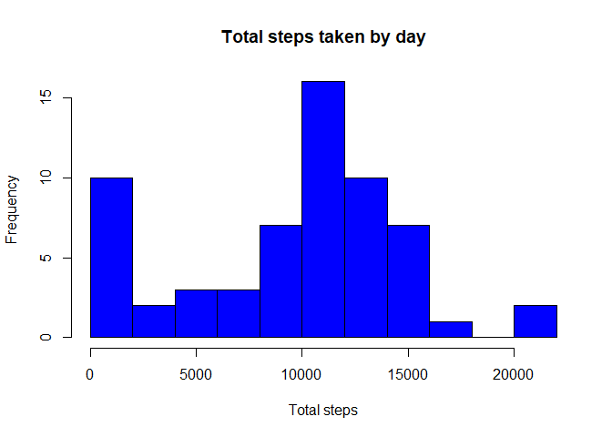
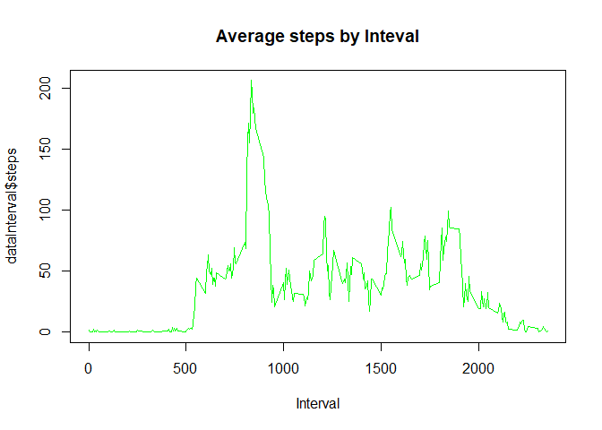
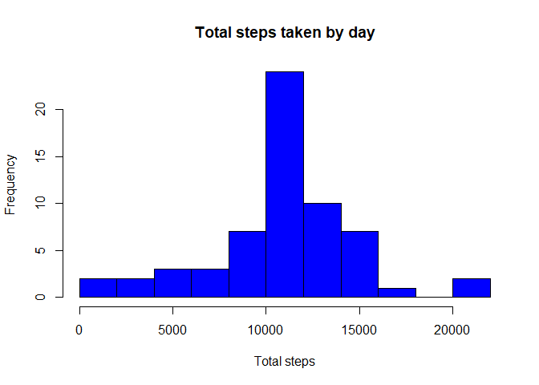
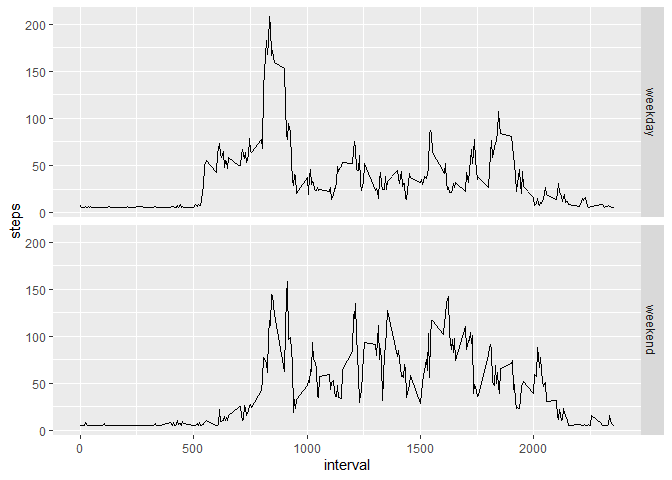

#This document contains assignment #1 for  Reproducable Research class.

## Loading and preprocessing the data


The variables in this dataset are:

1. steps: Number of steps taking in a 5-minute interval
2. date: the date of measure
3. interval: interval in which measure was taken


In this step, load necessary packages and download and unzip csv file. Then transform date variable to date format and finally print the structure of the data set.


```r
library(dplyr)
library(lubridate)
library(class)
library(zoo)
library(ggplot2)
Sys.setlocale("LC_TIME", "english")
```


```r
file <- 'activity.zip'
data<- 'activity.csv'

if (!file.exists(file)){
      URL <- "https://d396qusza40orc.cloudfront.net/repdata%2Fdata%2Factivity.zip"
      download.file(URL, file, method="curl")
      if (!(file.exists(data) )) {
            unzip(file)
              }
} 


data<-read.csv2(data,sep=',')
data<-mutate(data,date=ymd(date))
str(data)
```

```
## 'data.frame':	17568 obs. of  3 variables:
##  $ steps   : int  NA NA NA NA NA NA NA NA NA NA ...
##  $ date    : Date, format: "2012-10-01" "2012-10-01" ...
##  $ interval: int  0 5 10 15 20 25 30 35 40 45 ...
```


## What is mean total number of steps taken per day?

In this step I did the following:

1. group the data set by date to calculate total number of steps in each date
2. remove NA values 
3. calculate mean and median of total number steps by day. 
4. Next make the histogram showing total number of steps by day.
5. Print mean and median.


```r
dataday<-group_by(data,date)
dataday<-summarize(dataday,steps=sum(steps,na.rm = TRUE))
meanDaySteps<-mean(dataday$steps,na.rm=TRUE)
medianDaySteps<-median(dataday$steps,na.rm=TRUE)
hist(dataday$steps, main='Total steps taken by day', xlab='Total steps',breaks=10,col ='blue')
```

<!-- -->

```r
print('Mean of the total number of steps taken per day')
```

```
## [1] "Mean of the total number of steps taken per day"
```

```r
meanDaySteps
```

```
## [1] 9354.23
```

```r
print('Median of the total number of steps taken per day')
```

```
## [1] "Median of the total number of steps taken per day"
```

```r
medianDaySteps
```

```
## [1] 10395
```


## What is the average daily activity pattern?


In this step i did the following:

1. Group the data set by 5-minutes Intervale to calculate total number of steps in each Interval.
2. Remove NA values, 
3. Calculate the interval which mean is maximun. 
4. make the line plot and print the interval.


```r
dataInterval<-group_by(data,interval)
dataInterval<-summarize(dataInterval,steps=mean(steps,na.rm = TRUE))
maxInterval<-dataInterval[which.max(dataInterval$steps),1]
plot(dataInterval$interval,dataInterval$steps, main='Average steps by Inteval', xlab='Interval',type='l',col='green')
```

<!-- -->

```r
print('5-minute interval which on average contains the maximum number of steps')
```

```
## [1] "5-minute interval which on average contains the maximum number of steps"
```

```r
maxInterval[[1,1]]
```

```
## [1] 835
```


## Imputing missing values


In this step i did the following:

1. Get total number of rows with missing values.
2. Impute missing values replacing them with mean of all observations.
3. Impute missing values replacing them with mean of all observations.
1. group the data set by date to calculate total number of steps in each date
2. Remove NA values 
3. calculate mean and median of total number steps by day. 
4. Next make the histogram showing total number of steps by day.
5. Print mean and median.


```r
print('Total number of missing values in the dataset')
```

```
## [1] "Total number of missing values in the dataset"
```

```r
sum(is.na(data$steps))
```

```
## [1] 2304
```

```r
dataImp<-mutate(data,steps = (ifelse(is.na(steps),mean(steps,na.rm = TRUE),steps)))
                
dataday<-group_by(dataImp,date)
dataday<-summarize(dataday,steps=sum(steps,na.rm = TRUE))
meanDaySteps<-mean(dataday$steps,na.rm=TRUE)
medianDaySteps<-median(dataday$steps,na.rm=TRUE)
hist(dataday$steps, main='Total steps taken by day', xlab='Total steps',breaks=10,col='blue')
```

<!-- -->

```r
print('Mean of the total number of steps taken per day')
```

```
## [1] "Mean of the total number of steps taken per day"
```

```r
meanDaySteps
```

```
## [1] 10766.19
```

```r
print('Median of the total number of steps taken per day')
```

```
## [1] "Median of the total number of steps taken per day"
```

```r
medianDaySteps
```

```
## [1] 10766.19
```


We can see that imputation causes an increasse in both mean and meadian, and now both are the same value. Mean changes from 9354 to 10.766 wich is an increase major than 10%.


## Are there differences in activity patterns between weekdays and weekends?


In this step i did the following:

1. Create a list with names of weekdays (monday to friday)
2. Add a new caterogial column called 'weekday' indicating if observation ocurred in weekdays or weekend days.
1. group the data set by interval and weekday and summarize it.
2. Make a panel plot splitting information weekdays and weekend days.


```r
weekdays0 <- c('Monday', 'Tuesday', 'Wednesday', 'Thursday', 'Friday')
dataWeek<- mutate(dataImp,weekday = (ifelse(weekdays(date) %in% weekdays0,'weekday','weekend')))

dataWeek<-group_by(dataWeek,interval,weekday)
dataWeek<-summarize(dataWeek,steps=mean(steps,na.rm = TRUE))


g<-ggplot(data=dataWeek,aes(interval,steps))
g+geom_line() + facet_grid(rows = vars(weekday))
```

<!-- -->

